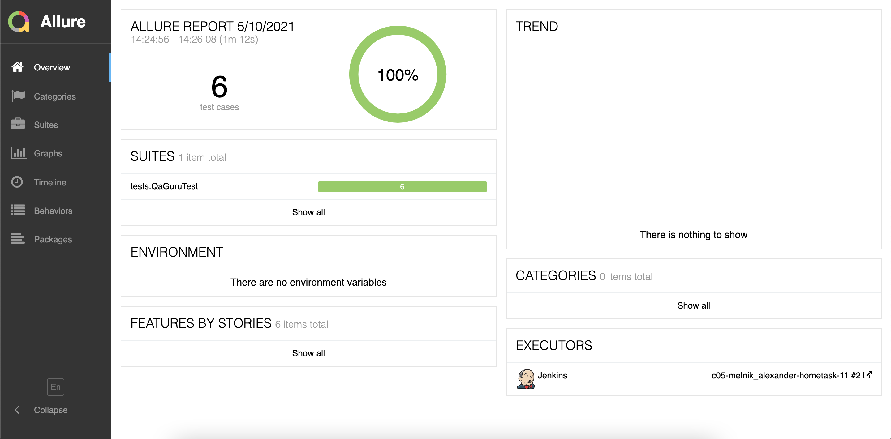
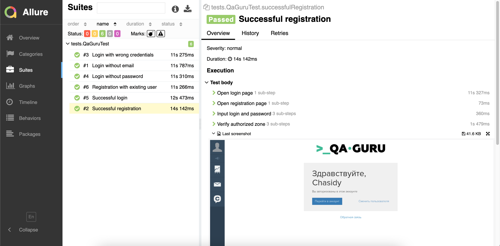
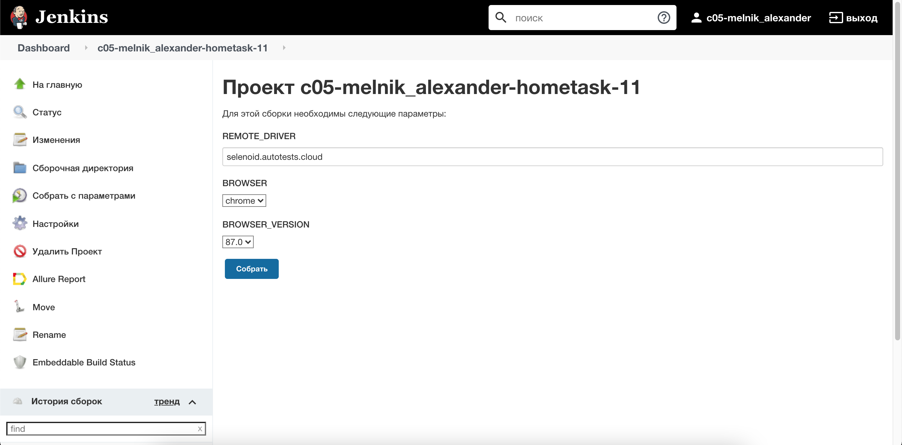
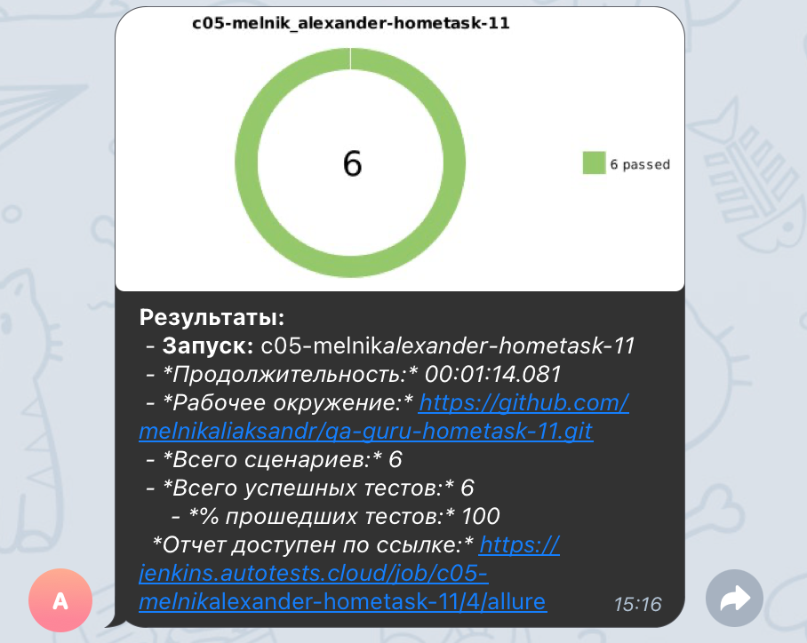

# UI automation tests for [QA GURU](https://qa.guru/)
## Technology Stack

- Java
- Gradle
- Junit5
- Selenide
- Allure Report
- Telegram Bot
- Jenkins
- Selenoid

### Allure reports

### CI

### Video

## Notification in Telegram

## Links
### Jenkins
https://jenkins.autotests.cloud/job/c05-melnik_alexander-hometask-11/
### Allure reports
https://jenkins.autotests.cloud/job/c05-melnik_alexander-hometask-11/2/allure/
